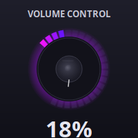

# Volume Monitor

Real-time system volume display with a circular rainbow dial for Linux (PipeWire/WirePlumber).



## Features

- Circular rainbow-colored volume indicator (24 segments)
- Metallic knob with indicator notch
- Real-time volume display via PipeWire (`wpctl`)
- Mouse wheel to change volume (1% step)
- Left-click to toggle mute/unmute
- Resizable window, position and size saved on exit

## Requirements

- Linux with PipeWire or PulseAudio (via WirePlumber)
- Qt5 (`qtbase5-dev`)
- C++ compiler with C++11 support

## Build

```bash
g++ -O2 -fPIC -o volume_monitor volume_monitor.cpp $(pkg-config --cflags --libs Qt5Widgets Qt5Core)
```

## Run

```bash
./volume_monitor
```

## Usage

- **Scroll wheel** — change volume (1% per step)
- **Left click** — toggle mute/unmute
- **Drag window edges** — resize (saved on exit)

## License

MIT
